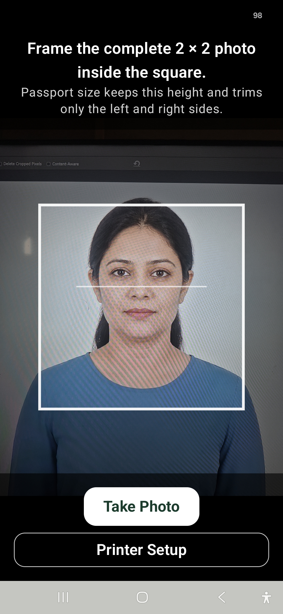
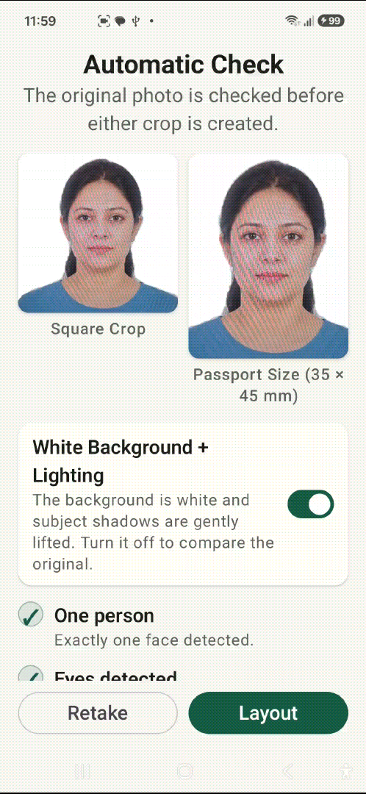
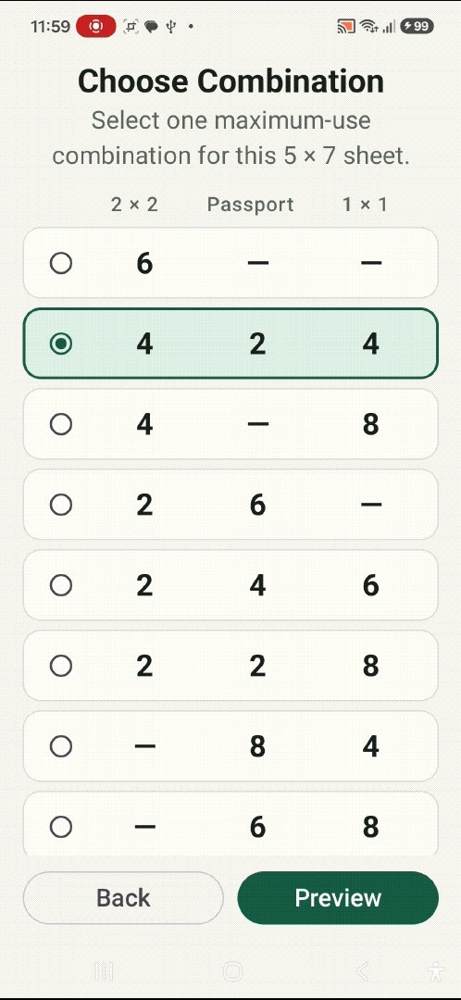
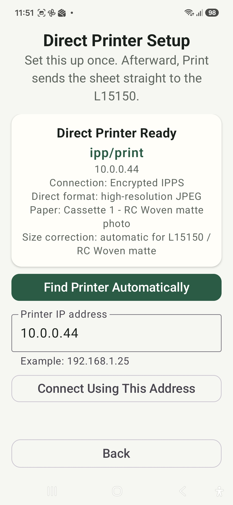
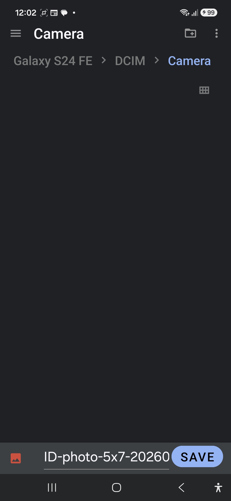
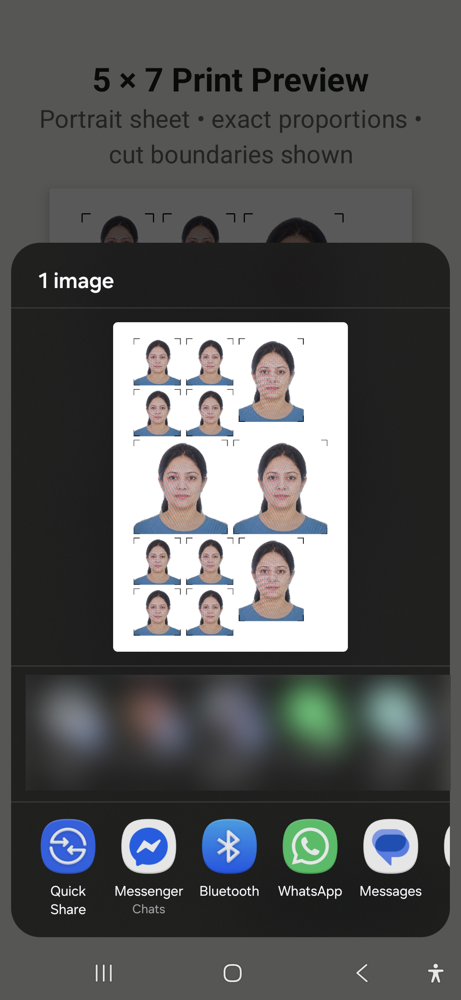

# Rene'R ID Print

[](https://github.com/tatselkrik/rene-r-id-print/actions/workflows/android-quality.yml)

Rene'R ID Print is a custom Android app for Rene'R's in-house ID-photo service. Capture one person, adjust the photo, choose one of eight combinations of 2×2-inch, 35×45 mm passport-size and 1×1-inch photos, then preview, save, share or print a 5×7-inch sheet directly to an Epson EcoTank L15150 over local Wi-Fi.

## Current release — v1.0.4

**[Download the signed APK](https://github.com/tatselkrik/rene-r-id-print/releases/download/v1.0.4/ReneR-ID-Print-v1.0.4.apk)** · **[Release notes and checksum](https://github.com/tatselkrik/rene-r-id-print/releases/tag/v1.0.4)**

Version 1.0.4 was released on September 22, 2026. Phone testing confirmed the compact controls work and the adjusted settings appear in printed photos. [GitHub quality checks passed for the release commit](https://github.com/tatselkrik/rene-r-id-print/actions/runs/35684277649).

The app is distributed as a signed APK, not through Google Play. Install v1.0.4 over v1.0.3 or an existing v1.0.4 test build without uninstalling. Versions 1.0.0–1.0.2 used the original signing identity and must be uninstalled first; save any photos you need before doing so, as uninstalling clears private settings and cache.

## Using the app

1. Connect the phone and printer to the same local network, normally the same Wi-Fi. Open the app and wait for **Printer ready**. Local printing does not require internet access.
2. Tap **Take Photo** and frame the complete photo inside the square, leaving room above the hair. The square crop follows that guide; the passport crop retains its height and trims the left and right sides.
3. On **Automatic Check**, inspect both crop previews and adjust the photo with the controls below them.
4. Tap **Layout**, choose a combination, then open **Preview**.
5. **Save** the sheet as a JPEG, **Share** it through Android's sharing panel, or tap **Print** to send it directly to the L15150.

### Photo adjustments

The compact review screen contains the crop images, a single row of **Background** and **Auto** toggles, then the sliders. **Brightness** and **Contrast** come first so they are easy to use while viewing the images. Scroll as needed for the remaining sliders and photo checks.

| Control | Behavior |
| --- | --- |
| Background | Replaces the detected background with white and gently lifts subject shadows. Turning it off retains the original background; any photo adjustments still apply. |
| Auto | Applies conservative brightness and contrast correction and disables manual sliders while on. Switching Auto clears manual edits; turning it off returns all sliders to neutral. |
| Brightness | Lightens or darkens the photo. |
| Contrast | Adjusts the separation between light and dark tones. |
| Vibrance | Adjusts muted colors more gently, with reduced effect on skin-like warm hues. |
| Saturation | Adjusts overall color intensity. |
| Temperature | Moves from cooler on the left to warmer on the right. |

There is no Exposure slider or separate Reset button. To clear manual edits, switch Auto on and off. Each new capture starts with neutral sliders and Auto off.

Edits are non-destructive: each change is calculated from the working image rather than accumulated over earlier edits. Both crop previews, the sheet preview, Save, Share and Print use the same adjusted image. Layout becomes available once the latest adjustment finishes. Replacement backgrounds stay white; direct printing adds the established printer-specific color and size corrections afterward.

### Photo checks and framing

On-device checks cover exactly one face, both eyes, obvious closed eyes, head angle, blur, resolution and framing. The detected face and eyes must fit in the square crop. Layouts containing passport photos also require them to fit in the narrower passport crop. Failed checks block Save, Share and Print for the affected layout.

These checks do not certify compliance with a particular passport authority or detect every hair/head-covering boundary. Inspect both previews and retake if needed. There are no manual crop-position or facial-reshaping controls.

### Automatic printer connection

The app checks the saved printer when opened or returned to the foreground and responds to Wi-Fi changes while visible. Capture remains available if the printer is offline. Print retries the connection when needed.

With no saved printer, discovery can pair automatically when exactly one L15150 is found. If discovery needs help or finds multiple printers, use **Printer Setup** to connect by address. Phone and printer must be able to communicate on the local network; guest/client isolation can prevent this even when Wi-Fi names match.

Printing uses encrypted IPPS only. Initial pairing trusts the printer certificate presented on the local network; later automatic connections must match it. A changed certificate requires an explicit reconnect in Printer Setup. The app does not silently replace it or fall back to unencrypted printing.

## Sheet layouts and print output

The default combination is **4 / 2 / 4**. All eight presets use fixed millimetre coordinates:

| 2×2-inch | Passport 35×45 mm | 1×1-inch |
| ---: | ---: | ---: |
| 6 | 0 | 0 |
| 4 | 2 | 4 |
| 4 | 0 | 8 |
| 2 | 6 | 0 |
| 2 | 4 | 6 |
| 2 | 2 | 8 |
| 0 | 8 | 4 |
| 0 | 6 | 8 |

Preview and export use the same layout geometry. Sheets are portrait 3000×4200 JPEGs with 600 dpi metadata, corresponding to 5×7 inches, with short black corner cutting guides. Horizontal gaps are at least 3 mm and vertical gaps at least 2 mm.

Direct printing requests Cassette 1, 5×7-inch portrait media, matte photographic paper and high quality for the L15150 with RC Woven matte stock. It retains the physically verified size correction of approximately 106.0% horizontally and 105.9% vertically, plus the printer-specific warmer tone (red 106%, green 101.5%, blue 94%). These printer corrections are additional to the operator's adjustments and are not applied to Save or Share. White replacement backgrounds and black cutting guides remain outside the photo color treatment.

No external printing app, PDF fallback or manual calibration screen is required.

## Screenshots from earlier versions

These retained walkthrough images show the interface before v1.0.4. In particular, Automatic Check now uses the compact controls described above; this gallery is historical, not a current UI reference.

<details>
<summary>View earlier walkthrough images</summary>

<table>
  <tr>
    <th>Take Photo</th>
    <th>Automatic Check</th>
    <th>Choose Combination</th>
  </tr>
  <tr>
    <td></td>
    <td></td>
    <td></td>
  </tr>
  <tr>
    <th>Printer Setup</th>
    <th>Save</th>
    <th>Share</th>
  </tr>
  <tr>
    <td></td>
    <td></td>
    <td></td>
  </tr>
</table>

</details>

## Build and signing

For normal use, install the release APK linked above. Android Studio is needed only for development.

Open the existing project in Android Studio and install Android SDK Platform 36.1, compatible Android Build-Tools, Platform-Tools and Command-line Tools. Use Android Studio's embedded JDK or JDK 17 or newer. Allow the first Gradle sync to download dependencies, then select the connected Android phone or an emulator and run the `app` configuration. Android Studio's development build uses a different signing identity from the release APK.

The project retains Gradle 9.1.0, Android Gradle Plugin 9.0.1, compile SDK 36.1, target SDK 36, min SDK 23, Compose BOM 2026.06.00, CameraX 1.6.1, ML Kit face detector 16.1.7 and selfie segmentation 16.0.0-beta6. The application ID remains `com.idphoto.printing`.

Typical verification on Windows, with the JDK configured:

```powershell
.\gradlew.bat testDebugUnitTest lintRelease assembleRelease
```

Release signing uses the preserved automatic key and Windows-protected credential on the configured account, without a password prompt. Private signing material is excluded from Git and release assets. See [Git and Release Guide](GIT_AND_RELEASE_GUIDE.md) for signing and publication instructions.

## Privacy and scope

Face checks and image adjustments run on-device. Captures and temporary generated sheets stay in app cache; photos are not uploaded to a cloud service. Explicitly saved JPEGs go to the location selected by the operator, sharing uses the selected Android app, and printing sends the sheet to the local printer.

The app targets the established L15150/RC Woven 5×7 workflow. Other paper sizes, printer calibration, remote internet printing, authority-specific passport composition rules and automatic photo-retention policies are outside the current implementation.

## Version history

### v1.0.4 — Compact photo adjustments

- Added Brightness, Contrast, Vibrance, Saturation and Temperature with Auto correction.
- Compacted the review screen to keep previews and frequently used controls together.
- Applied adjustments consistently to previews, saved/shared sheets and printing.
- Removed the superseded early planning document.
- Passed physical phone and print checks on September 22, 2026.

### v1.0.3 — Automatic printer connection and framing checks

- Added automatic saved-printer checks and recovery when Wi-Fi becomes available.
- Enforced encrypted printing and saved-certificate verification.
- Added face/eye crop-containment checks and layout-aware export blocking.
- Introduced the authorized automatic signing identity used by subsequent releases.
- Passed physical testing on September 14, 2026.

### v1.0.2 — Flexible sheet combinations

- Added eight maximum-use layouts with even-numbered quantities and the Choose Combination screen.
- Preserved exact photo dimensions and established print corrections.

### v1.0.1 — Photo finishing

- Added white-background processing, gentle subject-shadow lifting and warmer direct-print color correction.
- Fixed transparent backgrounds flattening to black during export.

### v1.0.0 — Initial release

- Introduced guided capture, face checks, fixed ID-photo crops, preview, JPEG Save/Share and direct Wi-Fi printing.

Earlier versions remain available through Git history and their existing tags.
